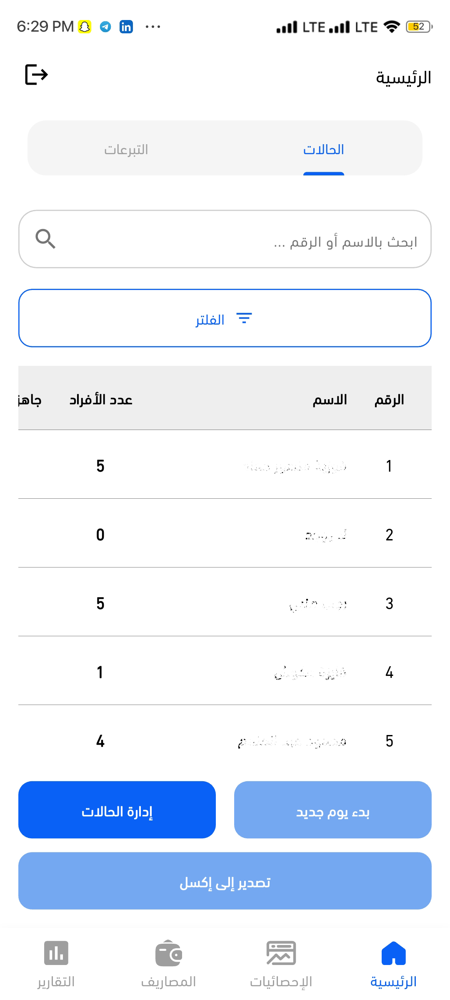

# Ramadan Meal Management App

## Project Overview
A mobile application to manage and streamline Ramadan meal distribution for two user roles:
- **Administrators**: Full control over cases, filtering, data export, meal preparation tracking, expense logging, and reports.
- **Donors**: View curated content (image carousel, daily meal details), cumulative feeding statistics, historical meal records, and make donations.

---

## Table of Contents
1. [Screenshots](#screenshots)  
2. [Administrator Features](#administrator-features)  
&nbsp;&nbsp;&nbsp;2.1 [Main Screen (TabBar)](#main-screen-tabbar)  
&nbsp;&nbsp;&nbsp;2.2 [Cases Tab](#cases-tab)  
&nbsp;&nbsp;&nbsp;2.3 [Control Panel Tab](#control-panel-tab)  
&nbsp;&nbsp;&nbsp;2.4 [Statistics Screen](#statistics-screen-admin)  
&nbsp;&nbsp;&nbsp;2.5 [Expenses Screen](#expenses-screen)  
&nbsp;&nbsp;&nbsp;2.6 [Reports Screen](#reports-screen-admin)  
3. [Donor Features](#donor-features)  
&nbsp;&nbsp;&nbsp;3.1 [Main Screen](#main-screen-donor)  
&nbsp;&nbsp;&nbsp;3.2 [Statistics Screen](#donor-statistics-screen)  
&nbsp;&nbsp;&nbsp;3.3 [Past Days Screen](#past-days-screen)  
&nbsp;&nbsp;&nbsp;3.4 [Reports Screen](#donor-reports-screen)  
4. [File Structure](#file-structure)  
5. [Getting Started](#getting-started)  
6. [Export & Data Management](#export--data-management)  
7. [Appendices](#appendices)


---

## <a name="screenshots"></a>Screenshots

To help visualize each feature of the Ramadan Meal Distribution App, below is a professionally numbered grid of screenshots organized by user role.

### Administrator Features

| # | Feature                               | Screenshot                                           |
|---|---------------------------------------|------------------------------------------------------|
| 1 | Main Screen (TabBar)                  |  |
| 2 | Cases Tab                             |      |
| 3 | Control Panel Tab                     |  |
| 4 | Statistics Screen                     |  |
| 5 | Expenses Screen                       |  |
| 6 | Reports Screen                        |   |

### Donor Features

| # | Feature                 | Screenshot                                         |
|---|-------------------------|----------------------------------------------------|
| 1 | Main Screen             |  |
| 2 | Statistics Screen       |  |
| 3 | Past Days Screen        |    |
| 4 | Reports Screen          |  |

---

## <a name="administrator-features"></a>Administrator Features

### <a name="main-screen-tabbar"></a>Main Screen (TabBar)
- **Tabs:**  
  1. **Cases**  
  2. **Control Panel**

### <a name="cases-tab"></a>Cases Tab
- **Case List**  
  - Name, Bag ID, Family Size  
  - Distribution Status (Done/Pending)  
  - Bag Availability (Here/Not Here)
- **Actions:**  
  - **Filter** by status (Ready to Distribute, Bag Here), group, family size, or all  
  - **Start New Day** — resets daily statistics  
  - **Export to Excel** — exports current case data  
  - **Manage Cases** — CRUD operations and view full family details (ID photo, contact, ages)

### <a name="control-panel-tab"></a>Control Panel Tab
- **Carousel** of images/promotions  
- **Daily Meal Display**  
  - Date & Day  
  - Meal Title & Description  
  - Expected Number of Recipients
- **Notifications**  
- **Donation Payment Info**  
  - List existing payment methods  
  - Add new payment info

### <a name="statistics-screen-admin"></a>Statistics Screen
- **Tab 1: Real-Time & Daily Metrics**  
  - Total fed today  
  - Prepared meals  
  - Remaining meals  
  - Fulfillment percentage
- **Tab 2: Cumulative Animated Progress**  
  - Engaging animation showing total fed since start of Ramadan

### <a name="expenses-screen"></a>Expenses Screen
- **Fields:**  
  - Product Category → Product → Unit  
  - Quantity → Unit Price → Payment Status (Paid/Unpaid)

### <a name="reports-screen-admin"></a>Reports Screen
- **Tab 1: Daily Expense Invoices**  
  - One "invoice" per day: date, total spent, list of purchased items  
- **Tab 2: Aggregated Quantities**  
  - Total purchased per product across days  
  - Purchase frequency details (date/time of each buy)

---

## <a name="donor-features"></a>Donor Features

### <a name="main-screen-donor"></a>Main Screen
- Mirrors Admin's carousel & daily meal info  
- View notifications, donation contact methods, and logout

### <a name="donor-statistics-screen"></a>Statistics Screen
- Displays total individuals fed since Ramadan began (static or animated)

### <a name="past-days-screen"></a>Past Days Screen
- List of previous days, each linking to that day's meal details

### <a name="donor-reports-screen"></a>Reports Screen
- Full access to expense and quantity reports like Admin view

---

## File Structure
```plaintext
└─ lib
   ├─ cloudinary_config.dart
   ├─ core
   │  ├─ cache
   │  │  └─ prefs.dart
   │  ├─ constants
   │  │  ├─ backend_endpoints.dart
   │  │  ├─ constatnts.dart
   │  │  └─ constatnts.dart~
   │  ├─ errors
   │  │  ├─ exception.dart
   │  │  └─ failure.dart
   │  ├─ functions
   │  │  ├─ get_current_user.dart
   │  │  ├─ show_snack_bar.dart
   │  │  └─ show_snack_bar.dart~
   │  ├─ helpers
   │  │  └─ app_regex.dart
   │  ├─ models
   │  │  └─ notficiation_model.dart
   │  ├─ private
   │  │  └─ private.dart
   │  ├─ routes
   │  │  ├─ app_routes.dart
   │  │  └─ on_generate_route.dart
   │  ├─ services
   │  │  ├─ data_base_service.dart
   │  │  ├─ firebase_auth_service.dart
   │  │  ├─ firebase_auth_service.dart~
   │  │  ├─ firestore_service.dart
   │  │  ├─ local_notfiication_service.dart
   │  │  ├─ push_notification_service.dart
   │  │  └─ service_locator.dart
   │  ├─ utils
   │  │  ├─ app_assets.dart
   │  │  ├─ app_colors.dart
   │  │  ├─ app_styles.dart
   │  │  ├─ app_texts.dart
   │  │  └─ app_theme.dart
   │  └─ widgets
   │     ├─ custom_text_form_field.dart
   │     ├─ email_field.dart
   │     ├─ general_button.dart
   │     └─ password_field.dart
   ├─ features
   │  ├─ auth
   │  │  ├─ data
   │  │  │  ├─ models
   │  │  │  │  └─ user_model.dart
   │  │  │  └─ repos
   │  │  │     ├─ auth_repo.dart
   │  │     │     └─ auth_repo_impl.dart
   │  │  └─ presentation
   │  │     ├─ manager
   │  │     │  ├─ admin_cubit
   │  │     │  │  ├─ admin_cubit.dart
   │  │     │  │  └─ admin_state.dart
   │  │     │  ├─ auth_cubit
   │  │     │  ├─ login_cubit
   │  │     │  │  ├─ login_cubit.dart
   │  │     │  │  └─ login_cubit_state.dart
   │  │     │  ├─ register_cubit
   │  │     │  │  ├─ register_cubit.dart
   │  │     │  │  └─ register_cubit_state.dart
   │  │     │  └─ reset_password_cubit
   │  │     │     ├─ reset_password_cubit.dart
   │  │     │     └─ reset_password_state.dart
   │  │     └─ views
   │  │        ├─ forget_password_view.dart
   │  │        ├─ login_view.dart
   │  │        ├─ register_view.dart
   │  │        ├─ register_view.dart~
   │  │        └─ widgets
   │  │           ├─ already_have_an_account.dart
   │  │           ├─ already_have_an_account.dart~
   │  │           ├─ custom_check_box.dart
   │  │           ├─ custom_otp_field.dart
   │  │           ├─ do_not_have_an_account.dart
   │  │           ├─ foreget_password.dart
   │  │           ├─ forget_password_view_body.dart
   │  │           ├─ forget_password_view_body.dart~
   │  │           ├─ forget_password_view_body_bloc_consumer.dart
   │  │           ├─ login_form.dart
   │  │           ├─ login_form.dart~
   │  │           ├─ login_view_body.dart
   │  │           ├─ login_view_body.dart~
   │  │           ├─ login_view_body_bloc_consumer.dart
   │  │           ├─ register_form.dart
   │  │           ├─ register_view_body.dart
   │  │           ├─ register_view_body_bloc_consumer.dart
   │  │           ├─ register_view_body_bloc_consumer.dart~
   │  │           ├─ reset_password_view_body.dart
   │  │           ├─ terms_and_conditions.dart
   │  │           ├─ terms_and_conditions.dart~
   │  │           └─ verify_view_body.dart~
   │  ├─ daily_expenses
   │  │  ├─ add_expenses_screen.dart
   │  │  ├─ daily_expenses.dart
   │  │  ├─ logic
   │  │  │  ├─ expense_cubit.dart
   │  │  │  └─ expense_state.dart
   │  │  ├─ model
   │  │  │  ├─ expense_model.dart
   │  │  │  └─ expense_model.dart~
   │  │  └─ services
   │  │     ├─ expense_service.dart
   │  │     └─ expense_service.dart~
   │  ├─ donation
   │  │  └─ presentation
   │  │     ├─ cubit
   │  │     │  ├─ donation_cubit.dart
   │  │     │  └─ donation_state.dart
   │  │     └─ views
   │  │        ├─ case_details_screen.dart
   │  │        ├─ donation_section.dart
   │  │        └─ widgets
   │  │           ├─ action_button.dart
   │  │           ├─ contact_header.dart
   │  │           ├─ contact_header.dart~
   │  │           ├─ contact_info_row.dart
   │  │           ├─ contact_list_item.dart
   │  │           ├─ contact_person.dart
   │  │           ├─ editable_donation_section.dart
   │  │           ├─ header_image.dart
   │  │           ├─ header_image.dart~
   │  │           ├─ meal_description.dart
   │  │           ├─ meal_title.dart
   │  │           ├─ notifications_screen.dart
   │  │           ├─ section_title.dart
   │  │           ├─ send_notification_screen.dart
   │  │           └─ send_notification_screen.dart~
   │  ├─ home
   │  │  ├─ data
   │  │  │  ├─ models
   │  │  │  └─ repos
   │  │  ├─ logic
   │  │  └─ presentation
   │  │     ├─ cubit
   │  │     └─ views
   │  │        ├─ home_view.dart
   │  │        └─ widgets
   │  │           ├─ admin_screen_layout.dart~
   │  │           ├─ home_view_body.dart
   │  │           ├─ home_view_body.dart~
   │  │           ├─ screen_layout.dart
   │  │           ├─ view_public_screen.dart
   │  │           └─ view_public_screen.dart~
   │  ├─ manage_cases
   │  │  ├─ data
   │  │  │  ├─ models
   │  │  │  │  ├─ cases_repository.dart
   │  │  │  │  ├─ manage_cases_model.dart
   │  │  │  │  └─ manage_cases_model.dart~
   │  │  │  └─ services
   │  │  │     ├─ file_utils.dart
   │  │  │     ├─ manage_cases_services.dart~
   │  │  │     └─ storage_utils.dart
   │  │  ├─ donation_section.dart~
   │  │  ├─ logic
   │  │  │  ├─ cases_cubit.dart
   │  │  │  └─ cases_state.dart
   │  │  ├─ manage_case-details_screen.dart~
   │  │  ├─ manage_cases.dart
   │  │  ├─ manage_case_details_screen.dart
   │  │  └─ widget
   │  │     ├─ action_buttons.dart~
   │  │     ├─ cases_data_table.dart~
   │  │     ├─ empty_state.dart~
   │  │     ├─ file_operations.dart~
   │  │     ├─ loading_indicator.dart~
   │  │     └─ pdf_exporter.dart~
   │  ├─ on_boarding
   │  │  ├─ data
   │  │  │  └─ models
   │  │  │     └─ on_boarding_model.dart
   │  │  └─ presentation
   │  │     └─ views
   │  │        ├─ login_or_register_view.dart
   │  │        ├─ on_boarding_view.dart
   │  │        └─ widgets
   │  │           ├─ custom_dots_indicators.dart
   │  │           ├─ custom_on_boarding_button.dart
   │  │           ├─ login_or_register_view_body.dart
   │  │           ├─ on_boarding_page_view.dart
   │  │           ├─ on_boarding_page_view_item.dart
   │  │           ├─ on_boarding_page_view_item.dart~
   │  │           ├─ on_boarding_view_body.dart
   │  │           ├─ row_buttons.dart
   │  │           ├─ top_login_or_register_section.dart
   │  │           └─ top_login_or_register_section.dart~
   │  ├─ previous_days
   │  │  └─ presentation
   │  │     ├─ views
   │  │     │  └─ previous_days_screen.dart
   │  │     └─ widgets
   │  │        ├─ card_of_previous.dart
   │  │        ├─ card_of_previous.dart~
   │  │        └─ details_of_previous_days.dart
   │  ├─ reports
   │  │  ├─ presentation
   │  │  │  ├─ views
   │  │  │  └─ widgets
   │  │  └─ reports.dart
   │  ├─ splash
   │  │  └─ presentation
   │  │     └─ views
   │  │        ├─ splash_view.dart
   │  │        └─ widgets
   │  │           └─ splash_view_body.dart
   │  └─ statistics
   │     ├─ presentation
   │     │  └─ views
   │     │     ├─ statistics_screen.dart
   │     │     └─ widgets
   │     │        ├─ total_statistics_content.dart
   │     │        └─ total_statistics_content.dart~
   │     └─ statistics_screen.dart~
   ├─ firebase_options.dart
   ├─ generated
   │  ├─ intl
   │  │  ├─ messages_all.dart
   │  │  ├─ messages_ar.dart
   │  │  └─ messages_en.dart
   │  └─ l10n.dart
   ├─ l10n
   │  ├─ intl_ar.arb
   │  └─ intl_en.arb
   └─ main.dart
```
## <a name="getting-started"></a>Getting Started
1. Clone repo:
   ```bash
   git clone https://github.com/hamdyhaggag/Ramadan_kitchen_management.git
   cd ramadan-kitchen-app
   ```
2. Install dependencies: `flutter pub get`
3. Configure Firebase: `flutterfire configure`
4. Add Cloudinary keys in `lib/core/private/private.dart`
5. Run: `flutter run`

## <a name="export--data-management"></a>Export & Data Management
- Use the Export to Excel action in the Cases Tab for case data  
- Reports Screen provides CSV/PDF exports for daily invoices and aggregated quantities

## <a name="appendices"></a>Appendices
- **CI/CD:** GitHub Actions (`.github/workflows/flutter.yml`) for linting, testing, and building APK/IPA
- **Testing:** `flutter test` for unit & widget tests, `flutter drive` for integration tests
- **License:** MIT — see [LICENSE](LICENSE)
- **Acknowledgements:** Flutter, Dart, Firebase, Material Design Icons — inspired by community Ramadan kitchen initiatives.

*Built with ❤️ by Hamdy Haggag.*
